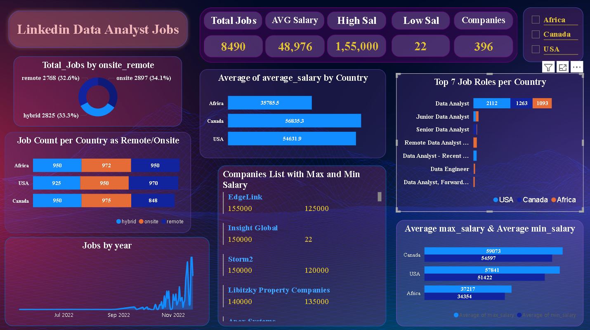

# LinkedIn Job Data Analysis (USA, Canada, Africa)

## Project Overview
An end-to-end data analytics project to clean, analyze, and visualize LinkedIn job postings using SQL, Python, and Power BI.

## Tools Used
- SQL Server Management Studio (SSMS)
- Python (Pandas, NumPy)
- Power BI
- Jupyter Notebook / Google Colab

## Project Structure
- `data/`: Cleaned dataset (no raw PII data shared)
- `notebooks/`: Python data cleaning code
- `sql/`: SQL queries for analysis
- `powerbi/`: Power BI dashboard file
- `reports/`: Final report and screenshots

## Key Insights
- Top 7 job roles and how they vary by country
- Salary trends (min, max, average)
- Job distribution by title, company, and location
- Remote vs on-site job breakdown

## Dashboard Preview

## How to Reproduce
1. Clone this repo
2. Open the `notebooks/` and run the Python code
3. Load the `Linkedin_Visualisation` in Power BI
   
## Contact
If you have any questions or feedback, feel free to reach out via GitHub Issues or email : manishankaryalapalle@gmail.com.

## Licence
Copyright 2025 Mani Shankar Yalapalle. All rights reserved.
